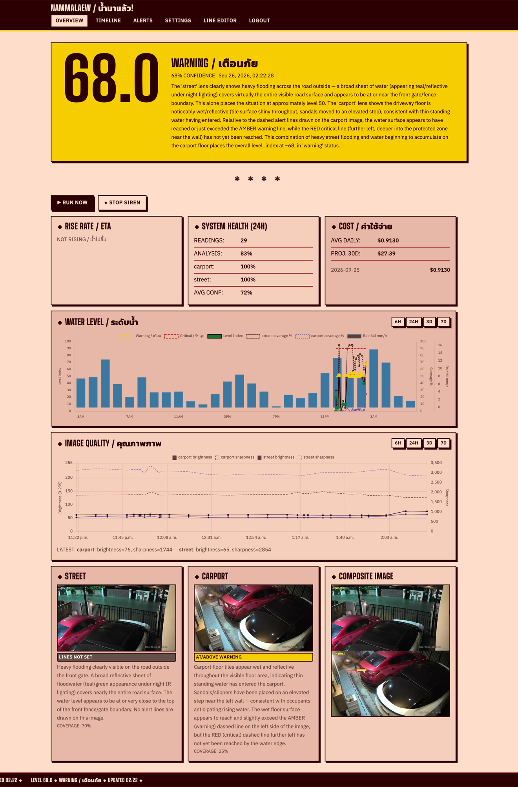

# น้ำมาแล้ว! — NamMaLaew

> A CCTV camera + AI that wakes you before the flood reaches your door.

Every 10 minutes it grabs a photo from both camera lenses, asks Claude (`claude -p`) how high the water is, and alerts you on Telegram (plus an optional Zigbee siren) when the water crosses a line you drew on the camera image.

<p align="center">
  
</p>

## 📷 Hardware used

**Camera: [IMILAB EC6 Dual](https://s.shopee.co.th/5q8StNbsnx)**, the one this project is built and tested with (Xiaomi model `chuangmi.camera.068ac1`, two lenses: street and carport).

Optional: a Zigbee siren through zigbee2mqtt (tested with a Tuya TS0216).

---

## ⚡ Quick Start: ~40 min total

1. **Camera → RTSP:** [Steps 1–6](#1-clone) (~20 min)
2. **Claude token and Telegram bot:** [Steps 7–8](#7-claude-token-human-only) (~7 min)
3. **`.env` → Docker → dashboard:** [Steps 9–10](#9-fill-env) (~10 min, mostly first build)
4. **Draw alert lines:** [Step 11](#11-draw-alert-lines) (~3 min)

🤖 **Using an AI agent to install?** Point it at [`docs/AI-AGENT-INSTALL.md`](docs/AI-AGENT-INSTALL.md).

---

## Why this exists

I live in Thailand. In the rainy season, street flooding can reach the house and the carport overnight. I wanted to sleep instead of getting up to check the street.

My IMILAB EC6 Dual camera speaks only Xiaomi's cloud/P2P protocol: no RTSP, no HTTP, no ONVIF. go2rtc's Xiaomi source fixed that. It logs in to Xiaomi's cloud once, pulls the stream on the LAN, and re-serves it as RTSP. From there, Claude looks at both lenses every 10 minutes, and Telegram wakes me only when the water crosses my line.

---

## You need

| Must have | Notes |
|---|---|
| Mac (Apple Silicon or Intel) + [Docker Desktop](https://www.docker.com/products/docker-desktop/) | Docker set to "Start at Login" |
| [IMILAB EC6 Dual](https://s.shopee.co.th/5q8StNbsnx), registered in Mi Home | |
| Claude subscription | No API key needed; uses `claude setup-token` |
| Telegram account | For the bot |

Optional: `ffmpeg` on the Mac (for testing streams in Step 6) and zigbee2mqtt + MQTT broker (for the siren).

---

## Install

Each step ends with ✅: the check that proves it worked. Do not move on until it passes.

### 1. Clone

```bash
git clone <repo-url> NamMaLaew && cd NamMaLaew
```

✅ `ls compose.yaml wlm/runner.py` lists both files.

### 2. Find the camera IP

Mi Home → camera → Settings → "Network info". Then probe it:

```bash
python3 -c "
import socket; s=socket.socket(socket.AF_INET,socket.SOCK_DGRAM); s.settimeout(1)
s.sendto(bytes.fromhex('21310020'+'ff'*28),('<CAMERA_IP>',54321))
print('OK, got',len(s.recvfrom(64)[0]),'bytes')"
```

✅ Prints `OK, got 32 bytes`. Next, set a **DHCP reservation** on your router so the IP never changes.

### 3. Install go2rtc (v1.9.14+)

```bash
ARCH=arm64   # Intel Mac: amd64
mkdir -p go2rtc
curl -L https://github.com/AlexxIT/go2rtc/releases/download/v1.9.14/go2rtc_mac_${ARCH}.zip -o /tmp/go2rtc.zip
unzip /tmp/go2rtc.zip -d go2rtc/ && xattr -d com.apple.quarantine go2rtc/go2rtc
cp go2rtc/go2rtc.yaml.example go2rtc/go2rtc.yaml
```

✅ `go2rtc/go2rtc --version` prints `go2rtc version v1.9.x`.

### 4. Log in to Xiaomi

```bash
cd go2rtc && ./go2rtc -config go2rtc.yaml
```

1. Open **http://127.0.0.1:1984** → **Add** → **Xiaomi**
2. Log in with your Mi Home account (captcha / 2FA may appear)

✅ `grep -q 'xiaomi:' go2rtc/go2rtc.yaml && echo "token saved"` prints `token saved`. This file is gitignored; never commit it.

### 5. Create `streams.yaml`

Find your device DID (User ID is in Mi Home → profile; try regions `sg`, `cn`, `de`, `i2`, `ru`, `us`):

```bash
curl "http://127.0.0.1:1984/api/xiaomi?id=<XIAOMI_USER_ID>&region=<REGION>"
```

Look for the `did` of model `chuangmi.camera.068ac1`. Then:

```bash
cp go2rtc/streams.yaml.example go2rtc/streams.yaml   # fill in the 4 placeholders
cd go2rtc && ./go2rtc -config go2rtc.yaml -config streams.yaml   # restart (Ctrl+C the old one)
```

`ec6` = carport lens, `ec6_2` = street lens. **Wait ~1 min** after every go2rtc restart before the camera streams.

✅ `curl -s http://127.0.0.1:1984/api/streams` lists `ec6` and `ec6_2`.

### 6. Test the streams

```bash
ffmpeg -rtsp_transport tcp -i rtsp://127.0.0.1:8554/ec6   -frames:v 1 /tmp/test-carport.jpg
ffmpeg -rtsp_transport tcp -i rtsp://127.0.0.1:8554/ec6_2 -frames:v 1 /tmp/test-street.jpg
```

✅ Both JPEGs exist and are larger than 10 KB. (No ffmpeg? Watch them in http://127.0.0.1:1984 instead.)

### 7. Claude token (human only)

In your own Terminal, not through an AI agent:

```bash
claude setup-token
```

✅ You have a token starting with `sk-ant-oat01-...` copied. It uses your subscription quota, is valid ~1 year, and can be revoked in claude.ai settings.

### 8. Telegram bot

1. Message **@BotFather** → `/newbot` → copy the **bot token**
2. Send any message to your new bot (required, or Telegram cannot deliver)
3. Open `https://api.telegram.org/bot<TOKEN>/getUpdates` → copy `chat.id`

✅ You have the bot token and the chat ID.

### 9. Fill `.env`

```bash
cp .env.example .env
```

Set these 5 keys (everything else has working defaults, see [Configuration](docs/CONFIGURATION.md)):

```dotenv
CLAUDE_CODE_OAUTH_TOKEN=sk-ant-oat01-...   # Step 7
TELEGRAM_BOT_TOKEN=...                     # Step 8
TELEGRAM_CHAT_ID=...
DASHBOARD_PASSWORD=choose-a-strong-password
DASHBOARD_SECRET=    # python3 -c "import secrets; print(secrets.token_hex(32))"
```

✅ This prints `set` four times:

```bash
for K in CLAUDE_CODE_OAUTH_TOKEN TELEGRAM_BOT_TOKEN TELEGRAM_CHAT_ID DASHBOARD_PASSWORD; do grep -qE "^$K=.+" .env && echo "$K: set" || echo "$K: MISSING"; done
```

### 10. Start it

```bash
docker compose up -d --build   # first build ~5–10 min
```

Open **http://localhost:8080** (or `http://<mac-ip>:8080` from your phone) and log in with `DASHBOARD_PASSWORD`.

✅ `curl -s -o /dev/null -w "%{http_code}" http://localhost:8080/healthz` prints `200`.

### 11. Draw alert lines

Dashboard → **LINE EDITOR** (top menu) → pick a lens → draw → Save.

- **CRITICAL** (red): where water becomes dangerous at your site. The lens with the red line decides CRITICAL, so draw it where the water actually arrives from.
- **WARNING** (amber): where water becomes worth a warning.

Then open **SETTINGS** → **SET UP FOR YOUR SITE** and work through the checklist, including describing your site in **Reference description**. Each setting's **i** button explains what it does.

✅ `/lines` shows your red line, and the checklist on **SETTINGS** reads `3 OF 3 CHECKED`.

### 12. Keep the Mac awake

```bash
sudo pmset -a sleep 0
```

✅ `pmset -g | grep "^sleep"` shows `sleep  0`. A sleeping Mac means no monitoring.

### 13. Optional: Zigbee siren (~10 min)

Needs zigbee2mqtt + an MQTT broker already on your LAN.

1. Add to `.env`: `MQTT_HOST`, `MQTT_PORT=1883`, `MQTT_USERNAME`, `MQTT_PASSWORD`, `SIREN_TOPIC=zigbee2mqtt/<friendly name>/set`
2. Run `docker compose up -d`
3. Dashboard → Settings → **Siren (MQTT)** → **TEST SIREN (1 S)**
4. Tick `siren_enabled` → Save

✅ The siren sounds for 1 second and stops.

---

## Daily use

| Do this | How |
|---|---|
| Check now | Dashboard `/` → **▶ RUN NOW** |
| Silence the siren | **◆ STOP SIREN** |
| Silence until the water drops | **◆ MUTE UNTIL WATER DROPS** (Telegram keeps alerting; auto-unmutes when a reading drops below the muted level) |
| Update | `git pull && docker compose up -d --build` |
| After editing `.env` | `docker compose up -d` |
| Watch logs | `docker compose logs -f monitor` |
| Mark a reading right or wrong | **TIMELINE** → open the reading → **◆ FEEDBACK** → **CORRECT** or **WRONG** (with **TRUE STATUS** and **TRUE LEVEL INDEX**) → **SAVE FEEDBACK** |
| Add a reference example for Claude | Same form → tick **USE AS REFERENCE EXAMPLE**. Only while the reading's snapshots still exist (`SNAPSHOT_RETENTION_HOURS`, default 7 days). If an answer that used examples or history is lower than the previous reading, Claude checks again without them and the higher result is kept. Manage them in **SETTINGS** → **◆ LEARNING** |

**What triggers alerts:**

- **WARNING:** `level_index` ≥ 50, or water at the amber line
- **CRITICAL:** water at the red line
  - `level_index` ≥ 90 counts only when no red line is drawn; with a red line it can only raise WARNING
  - Confirmed by a second reading ~2 min later (stops false alarms from dark or wet floors)
  - A CRITICAL whose calibrated confidence is below `min_confidence` (default 0.5) is always re-checked this way, even with `critical_confirm` off
  - Repeats every 10 min while critical
- **Failure:** 3 checks in a row with no result, a camera down, or the water edge not visible at the red line

**After a Mac reboot:** start go2rtc again from Terminal (Step 5's command). Auto-start via launchd does not work yet, see [Known issues](docs/TROUBLESHOOTING.md#known-issues).

---

## Top 5 problems

| Symptom | Fix |
|---|---|
| Status `UNKNOWN` + "Not logged in" | Token expired: redo Step 7, update `.env`, `docker compose up -d` |
| Status `UNKNOWN` + "All snapshot captures failed" | go2rtc not running: start it from Terminal, wait 1 min |
| Dashboard shows HTTP 503 | `DASHBOARD_PASSWORD` empty in `.env` |
| No Telegram messages | Settings → **SEND TEST MESSAGE**; make sure you messaged the bot first |
| Siren: `MQTT connect failed: Not authorized` | Fix `MQTT_USERNAME` / `MQTT_PASSWORD` in `.env` |

More: [docs/TROUBLESHOOTING.md](docs/TROUBLESHOOTING.md).

---

## More docs

- [How it works](docs/HOW-IT-WORKS.md): architecture, capture cycle, water-level index, Claude cost, feedback and learning
- [Configuration](docs/CONFIGURATION.md): every `.env` key and dashboard setting
- [Troubleshooting](docs/TROUBLESHOOTING.md): all symptoms and known issues
- [Development](docs/DEVELOPMENT.md): tests, CLI flags, code layout
- [AI agent install](docs/AI-AGENT-INSTALL.md): step-by-step runbook for Claude Code and similar agents

---

## 🔒 Never commit

`.env` · `go2rtc/go2rtc.yaml` · `go2rtc/streams.yaml` · `data/` · `snapshots/` · `logs/`

All of these are already gitignored. Check with `git check-ignore -v <file>`.

---

## License

MIT, see [`LICENSE`](LICENSE). Bundled fonts (SIL OFL 1.1) and chart libraries (MIT) keep their own licenses, see [`THIRD_PARTY_NOTICES.md`](THIRD_PARTY_NOTICES.md). go2rtc is downloaded separately (MIT).
